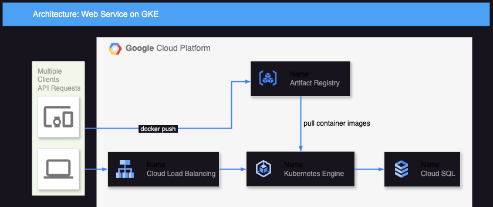

# Datadog を使用したサンプルアプリケーション

## 概要

このリポジトリをクローンし、後述の `terraform` コマンドや `kubectl` コマンドなどを実行すると、以下アーキテクチャ図の Google Cloud リソースが作成され、Java アプリケーションコンテナおよび Datadog Agent コンテナを GKE にデプロイできます。

コマンドについては、[ビルドと実行（ Google Cloud ）](#ビルドと実行--google-cloud-)を参照してください。



また、後述の `docker compose` コマンドなどを実行すると、以下のコンテナをローカルで実行できます。

コマンドについては、[ビルドと実行（ローカル）](#ビルドと実行--ローカル-)を参照してください。

- Java アプリケーション（ Web サービス）コンテナ
- Datadog Agent コンテナ
- PostgreSQL コンテナ
- Jenkins コンテナ

## アプリケーションについて

- Web フレームワークとして、Spring Boot を使用しています。
- HTTP リクエストの内容を PostgreSQL に登録します。
- ログは、Datadog でパースされるように JSON 形式で出力するように設定しています。
- `mvn test` コマンドを実行することで、単体テストを実行できます。

## 有効化されている Datadog 機能

CI Visibility 以外は、手動作業なしに以下の Datadog 機能が有効化されます。

CI Visibility を有効化するには、手動で [Jenkins への Datadog プラグイン導入](https://docs.datadoghq.com/ja/continuous_integration/pipelines/jenkins/?tab=linux#datadog-jenkins-%E3%83%97%E3%83%A9%E3%82%B0%E3%82%A4%E3%83%B3%E3%82%92%E3%82%A4%E3%83%B3%E3%82%B9%E3%83%88%E3%83%BC%E3%83%AB)および Jenkins ジョブの作成を行う必要があります。

- Live Processes
- Application Performance Monitoring
- Continuous Profiler
- Log Management（トレースと接続済み）
- Application Security Management
- CI Visibility（ローカルの場合のみ）
- Database Monitoring（トレースと接続済み、ローカルの場合のみ）
- Network Performance Monitoring（ Google Cloud の場合のみ）
- Universal Service Monitoring（ Google Cloud の場合のみ）

## ビルドと実行 （ Google Cloud ）

### 前提条件

- こちらの[ドキュメント](https://docs.docker.com/engine/install/)を参考に Docker をインストールしてください。
- マルチプラットフォームコンテナイメージを作成するために、こちらの[ドキュメント](https://docs.docker.com/desktop/containerd/#turn-on-the-containerd-image-store-feature)を参考に Docker Desktop の `Use containerd for pulling and storing images` を有効化してください。
- こちらの[ドキュメント](https://helm.sh/ja/)を参考に `Helm` をインストールしてください。
- こちらの[ドキュメント](https://developer.hashicorp.com/terraform/tutorials/aws-get-started/install-cli)を参考に `Terraform` をインストールしてください。
- こちらの[ドキュメント](https://cloud.google.com/kubernetes-engine/docs/how-to/cluster-access-for-kubectl?hl=ja#install_plugin)を参考に `gke-gcloud-auth-plugin` をインストールしてください。
- その他の前提条件については、こちらの[ドキュメント](https://developer.hashicorp.com/terraform/tutorials/kubernetes/gke?utm_medium=WEB_IO&in=terraform%2Fkubernetes&utm_content=DOCS&utm_source=WEBSITE&utm_offer=ARTICLE_PAGE#prerequisites)を参照してください。

### 事前作業

`.env` ファイルの `DD_API_KEY` に Datadog の API キーを設定してください。

### `terraform/terraform.tfvars` ファイルの変更

`terraform/terraform.tfvars` ファイルを以下のとおりに変更してください。

- `project_id` に Google Could のプロジェクト ID を設定してください。
- Google Cloud リソース名の重複を避けるために、`env` に任意の値を設定してください。
- こちらの[サイト](https://www.cman.jp/network/support/go_access.cgi)でグローバル IP アドレスを確認し、`your_global_ip_address` にグローバル IP アドレスを設定してください。

### 各種 Google Cloud API の有効化

任意のディレクトリで以下のコマンドを実行してください。

```bash
gcloud services enable artifactregistry.googleapis.com

gcloud services enable compute.googleapis.com

gcloud services enable container.googleapis.com

gcloud services enable sqladmin.googleapis.com
```

### Google Cloud リソースの作成

`terraform` ディレクトリで以下のコマンドを実行してください。

```bash
terraform init

terraform apply
```

### コマンドとファイルの変更

後述のコマンドおよびファイルを以下のとおりに変更してください。

- `${PROJECT_ID}` を `terraform/terraform.tfvars` ファイルに記載されている `project_id` の値に置き換えてください。
- `${REGION}` を `terraform/terraform.tfvars` ファイルに記載されている `region` の値に置き換えてください。
- `${ENV}` を `terraform/terraform.tfvars` ファイルに記載されている `env` の値に置き換えてください。

コマンドの例については、`example-command.sh` を参照してください。

### アプリケーションコンテナイメージのビルドとプッシュ

`Dockerfile` が存在するディレクトリで以下のコマンドを実行してください。

```bash
gcloud auth configure-docker ${REGION}-docker.pkg.dev

docker buildx build . -t ${REGION}-docker.pkg.dev/${PROJECT_ID}/${ENV}-repository/java-app-on-gke-with-datadog:latest --platform linux/amd64,linux/arm64 --build-arg DD_GIT_REPOSITORY_URL=github.com/ogu1101/java-app-on-gke-with-datadog --build-arg DD_GIT_COMMIT_SHA=$(git rev-parse HEAD)

docker push ${REGION}-docker.pkg.dev/${PROJECT_ID}/${ENV}-repository/java-app-on-gke-with-datadog:latest
```

### `k8s/manifests.yaml` ファイルの変更

`k8s/manifests.yaml` ファイルを以下のとおりに変更してください。

変更が必要な箇所には、`# REPLACE ME` というコメントが記載されています。

- `image: us-central1-docker.pkg.dev/tribal-iridium-308123/shuhei-repository/java-app-on-gke-with-datadog:latest` を `image: ${REGION}-docker.pkg.dev/${PROJECT_ID}/${ENV}-repository/java-app-on-gke-with-datadog:latest` に置き換えてください。
- `- "tribal-iridium-308123:us-central1:shuhei-cloud-sql"` を `- "${PROJECT_ID}:${REGION}:${ENV}-cloud-sql"` に置き換えてください。
- `kubernetes.io/ingress.global-static-ip-name: shuhei-ip-address` を `kubernetes.io/ingress.global-static-ip-name: ${ENV}-ip-address` に置き換えてください。

### Kubernetes リソースのデプロイ

以下コマンドの `${API-KEY}` を Datadog の API キーに置き換えてください。

`k8s` ディレクトリで以下のコマンドを実行してください。

```bash
gcloud container clusters get-credentials --zone ${REGION} ${ENV}-gke

helm repo add datadog https://helm.datadoghq.com

helm repo update

kubectl create secret generic datadog-secret --from-literal api-key=${API-KEY}

helm install datadog-agent -f datadog-values.yaml datadog/datadog

kubectl apply -f service-account.yaml

kubectl annotate serviceaccount ksa-cloud-sql iam.gke.io/gcp-service-account=${ENV}-service-account-id@${PROJECT_ID}.iam.gserviceaccount.com

kubectl apply -f manifests.yaml
```

### HTTP リクエストの送信

リクエスト送信先のグローバル IP アドレスを確認するために、`kubectl get service app` コマンドを実行してください。

実行結果の例は、以下のとおりです。

```bash
shuhei.ogura@COMP-R7QQCTJ177 k8s % kubectl get service app
NAME   TYPE           CLUSTER-IP       EXTERNAL-IP     PORT(S)          AGE
app    LoadBalancer   10.187.247.149   35.238.101.70   8080:31303/TCP   38h
```

以下コマンドの `${EXTERNAL-IP}` を上記の `EXTERNAL-IP` に置き換えたうえで、以下コマンドを実行してください。

```bash
curl -v -X POST -H 'Content-Type:application/json' -d '{"message":"Hello", "target":"Kagetaka"}' ${EXTERNAL-IP}:8080/greeting
```

### Kubernetes リソースの削除

`k8s` ディレクトリで以下のコマンドを実行してください。

```bash
kubectl delete -f manifests.yaml -f service-account.yaml

helm uninstall datadog-agent
```

### Google Cloud リソースの削除

`terraform` ディレクトリで以下のコマンドを実行してください。

```bash
terraform destroy
```

## ビルドと実行 （ ローカル ）

### 前提条件

- こちらの[ドキュメント](https://docs.docker.com/engine/install/)を参考に Docker をインストールしてください。
- ローカル用の Datadog Agent コンテナは、Mac OS のみで正しく動作する想定です。

### 事前作業

`.env` ファイルの `DD_API_KEY` に Datadog の API キーを設定してください。

### コンテナの起動

`compose.yaml` が存在するディレクトリで以下のコマンドを実行してください。

```bash
docker compose up -d --build
```

### HTTP リクエストの送信

アプリケーションコンテナに HTTP リクエストを送信するには、以下のコマンドを実行してください。

```bash
curl -v -X POST -H 'Content-Type:application/json' -d '{"message":"Hello", "target":"Kagetaka"}' 127.0.0.1:8080/greeting
```

### Jenkins

Jenkins にアクセスするための URL は、http://localhost:8888 です。

Jenkins にアクセスするためのユーザー名とパスワードは、Jenkins コンテナ起動時のログに出力されます。

### コンテナの停止

`compose.yaml` が存在するディレクトリで以下のコマンドを実行してください。

```bash
docker compose down
```

## References

- [Spring Initializr](https://start.spring.io/)
- [Provision a GKE cluster (Google Cloud)](https://developer.hashicorp.com/terraform/tutorials/kubernetes/gke)
- [Google Kubernetes Engine から Cloud SQL に接続する](https://cloud.google.com/sql/docs/mysql/connect-kubernetes-engine?hl=ja)
- [基本的な本番環境クラスタ用にネットワークを構成する](https://cloud.google.com/kubernetes-engine/docs/tutorials/configure-networking?hl=ja)
- [Google Cloud リソース別の Terraform 公式ページ](https://registry.terraform.io/providers/hashicorp/google/latest/docs)
- [Cloud SQL で高可用性を有効または無効にする](https://cloud.google.com/sql/docs/postgres/configure-ha?hl=ja#terraform)
